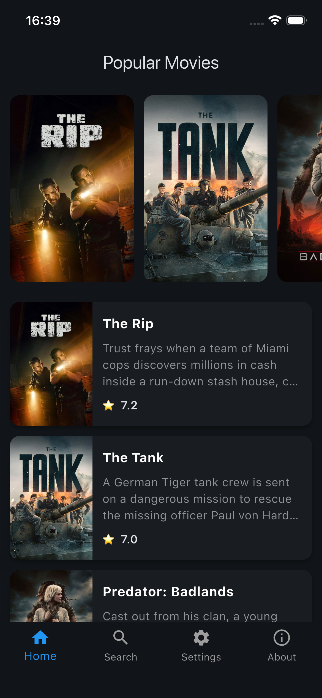
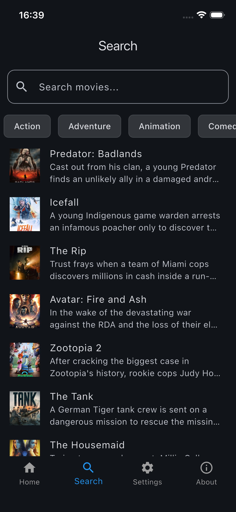
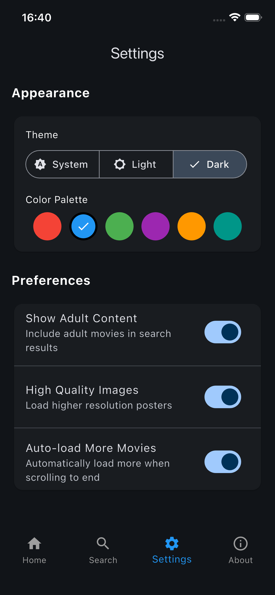
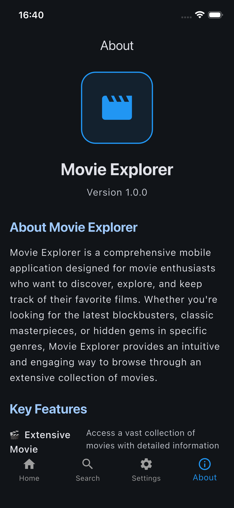
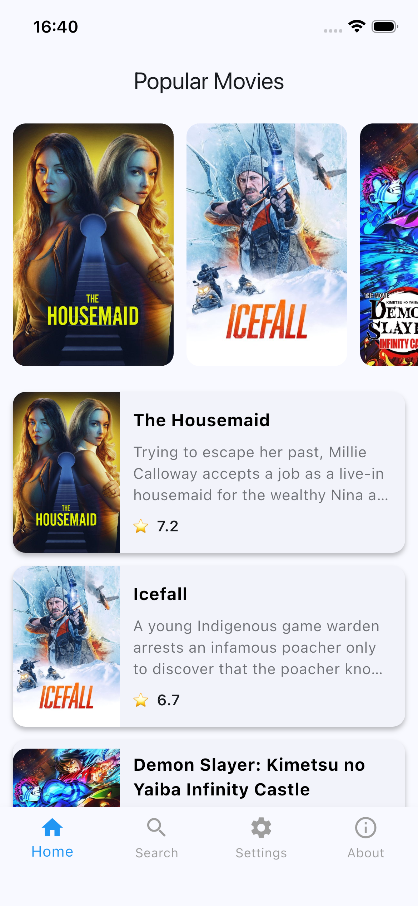
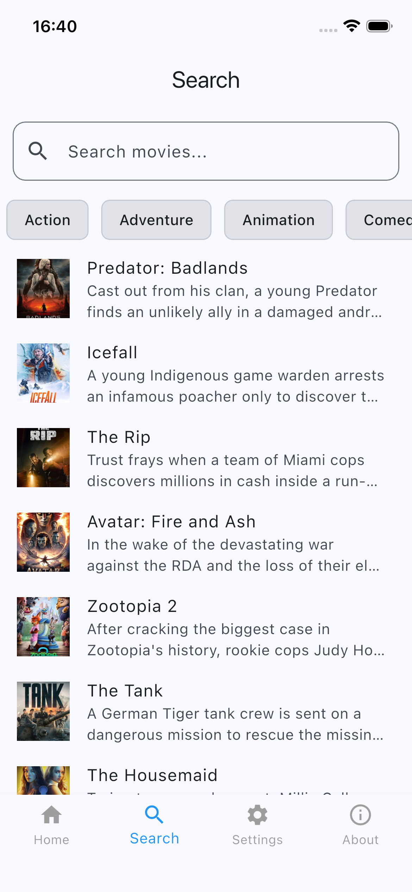
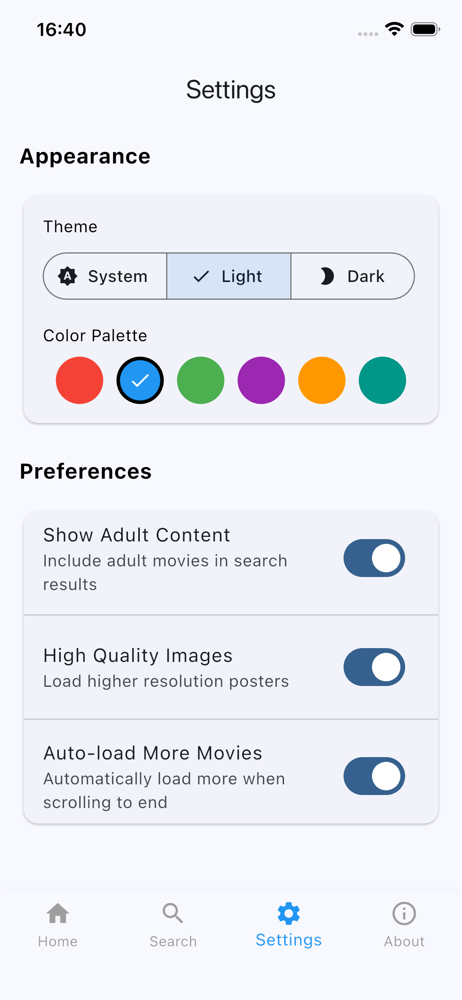
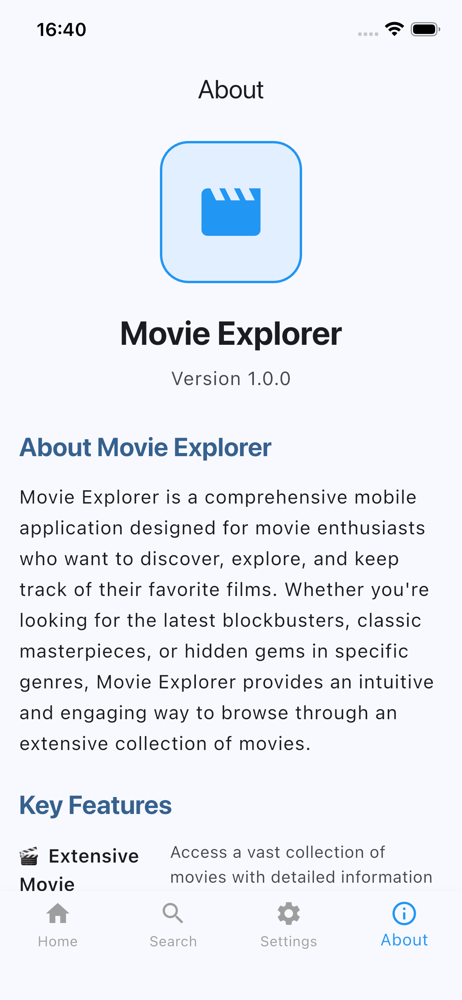

# 🎬 Movie Flutter App

A beautifully designed, feature-rich Flutter application for discovering and exploring movies. Built with modern Flutter architecture and Material Design 3, this app provides an immersive movie browsing experience with comprehensive movie information from TMDB (The Movie Database).


## 📱 Screenshots

  |  |

|--------|----------|
|  |  |

|  |  |  |

|--------|----------|
|  |  |

## ✨ Features

### 🎯 Core Features
- **Movie Discovery**: Browse trending, popular, and top-rated movies
- **Advanced Search**: Search movies by title with real-time results
- **Genre Filtering**: Filter movies by specific genres
- **Movie Details**: Comprehensive movie information including cast, crew, ratings, and trailers
- **Offline Support**: Local storage for user preferences and settings

### 🎨 User Experience
- **Material Design 3**: Modern, adaptive UI with dynamic theming
- **Dark/Light Mode**: Automatic theme switching based on system preferences
- **Smooth Animations**: Fluid transitions and loading animations
- **Responsive Design**: Optimized for various screen sizes and orientations
- **Pull-to-Refresh**: Easy content refresh with swipe gestures

### 🔧 Technical Features
- **State Management**: Provider pattern for efficient state management
- **API Integration**: Robust TMDB API integration with error handling
- **Local Storage**: SharedPreferences for persistent user settings
- **Network Handling**: Graceful error handling with retry mechanisms
- **Performance Optimized**: Efficient data loading and caching

## 🚀 Getting Started

### Prerequisites

Before running this application, make sure you have the following installed:

- **Flutter SDK** (>=3.10.7)
- **Dart SDK** (>=3.0.0)
- **Android Studio** or **VS Code** with Flutter extensions
- **TMDB API Key** (Get one from [TMDB](https://www.themoviedb.org/settings/api))

### Installation

1. **Clone the repository**
   ```bash
   git clone https://github.com/OmkarVijayBagade/movie_flutter_app.git
   cd movie_flutter_app
   ```

2. **Install dependencies**
   ```bash
   flutter pub get
   ```

3. **Set up TMDB API Key**

   Create a file `lib/core/constants/api_constants.dart` and add your TMDB API key:
   ```dart
   const String tmdbApiKey = 'YOUR_API_KEY_HERE';
   const String tmdbBaseUrl = 'https://api.themoviedb.org/3';
   const String imageBaseUrl = 'https://image.tmdb.org/t/p/w500';
   ```

4. **Run the app**
   ```bash
   flutter run
   ```

### Build Commands

- **Debug Build**: `flutter run`
- **Release Build**: `flutter run --release`
- **Build APK**: `flutter build apk --release`
- **Build iOS**: `flutter build ios --release`

## 🏗️ Architecture

This application follows a clean architecture pattern with clear separation of concerns:

```
lib/
├── core/                 # Core functionality
│   ├── constants/       # App constants and configurations
│   ├── navigation/      # Navigation routes and setup
│   └── theme/          # Theme configurations
├── models/              # Data models
│   ├── movie.dart      # Movie data model
│   └── genre.dart      # Genre data model
├── providers/          # State management (Provider pattern)
│   ├── movie_provider.dart
│   └── settings_provider.dart
├── screens/            # UI Screens
│   ├── home/          # Home screen
│   ├── search/        # Search functionality
│   ├── movie_detail/  # Movie details screen
│   ├── settings/      # Settings screen
│   ├── onboarding/    # Onboarding flow
│   └── splash/        # Splash screen
├── services/          # Business logic and API calls
│   ├── movie_api_service.dart
│   └── local_storage.dart
└── widgets/           # Reusable UI components
```

### State Management

The app uses the **Provider** pattern for state management:
- **MovieProvider**: Manages movie data, search results, and API states
- **SettingsProvider**: Handles user preferences, theme settings, and app configuration

### API Integration

- **TMDB API**: Comprehensive movie database integration
- **Error Handling**: Robust error handling with user-friendly messages
- **Caching**: Efficient data caching and offline support

## 🛠️ Technologies Used

### Core Framework
- **Flutter**: Cross-platform mobile development framework
- **Dart**: Programming language for Flutter

### State Management
- **Provider**: Simple and powerful state management solution

### Networking & Storage
- **HTTP**: For API communication
- **SharedPreferences**: Local data persistence

### UI/UX
- **Material Design 3**: Modern design system
- **Custom Themes**: Dynamic theming with light/dark mode support
- **Animations**: Smooth transitions and loading states

### Development Tools
- **Flutter SDK**: Development framework
- **Dart DevTools**: Debugging and performance monitoring
- **Flutter Analyze**: Code quality assurance

## 📱 Supported Platforms

- **Android**: API 21+ (Android 5.0+)
- **iOS**: iOS 11.0+
- **Web**: Modern web browsers (Chrome, Firefox, Safari, Edge)
- **macOS**: macOS 10.14+
- **Windows**: Windows 10+
- **Linux**: Ubuntu 18.04+

## 🔧 Configuration

### Environment Variables

Create a `.env` file in the root directory for configuration:

```env
TMDB_API_KEY=your_api_key_here
TMDB_BASE_URL=https://api.themoviedb.org/3
IMAGE_BASE_URL=https://image.tmdb.org/t/p/w500
```

### Build Flavors

The app supports multiple build flavors for different environments:

- **Development**: `flutter run --flavor development`
- **Staging**: `flutter run --flavor staging`
- **Production**: `flutter run --flavor production`

## 🧪 Testing

Run tests using the following commands:

```bash
# Run all tests
flutter test

# Run tests with coverage
flutter test --coverage

# Run integration tests
flutter test integration_test/
```

## 📦 Deployment

### Android
```bash
flutter build apk --release
flutter build appbundle --release
```

### iOS
```bash
flutter build ios --release
```

### Web
```bash
flutter build web --release
```

## 🤝 Contributing

We welcome contributions! Please follow these steps:

1. Fork the repository
2. Create a feature branch (`git checkout -b feature/amazing-feature`)
3. Commit your changes (`git commit -m 'Add amazing feature'`)
4. Push to the branch (`git push origin feature/amazing-feature`)
5. Open a Pull Request

### Development Guidelines

- Follow Flutter best practices and conventions
- Write clear, concise commit messages
- Add tests for new features
- Update documentation as needed
- Ensure code passes all linting checks

## 📄 License

This project is licensed under the MIT License - see the [LICENSE](LICENSE) file for details.

## 🙏 Acknowledgments

- **TMDB**: For providing comprehensive movie data
- **Flutter Team**: For the amazing cross-platform framework
- **Material Design Team**: For the beautiful design system
- **Open Source Community**: For the incredible tools and libraries

## 📞 Support

If you have any questions or need help:

- **Issues**: [GitHub Issues](https://github.com/OmkarVijayBagade/movie_flutter_app/issues)
- **Discussions**: [GitHub Discussions](https://github.com/OmkarVijayBagade/movie_flutter_app/discussions)
- **Email**: omkarbagade16@gmail.com

---

**Made with ❤️ using Flutter**
